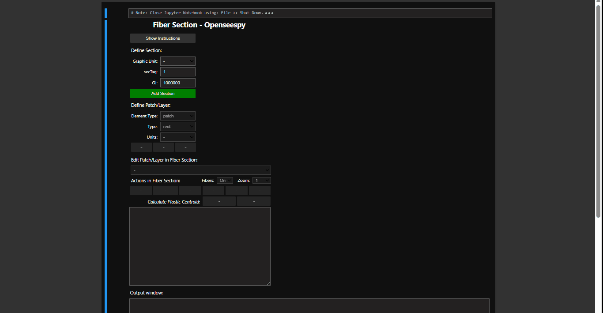
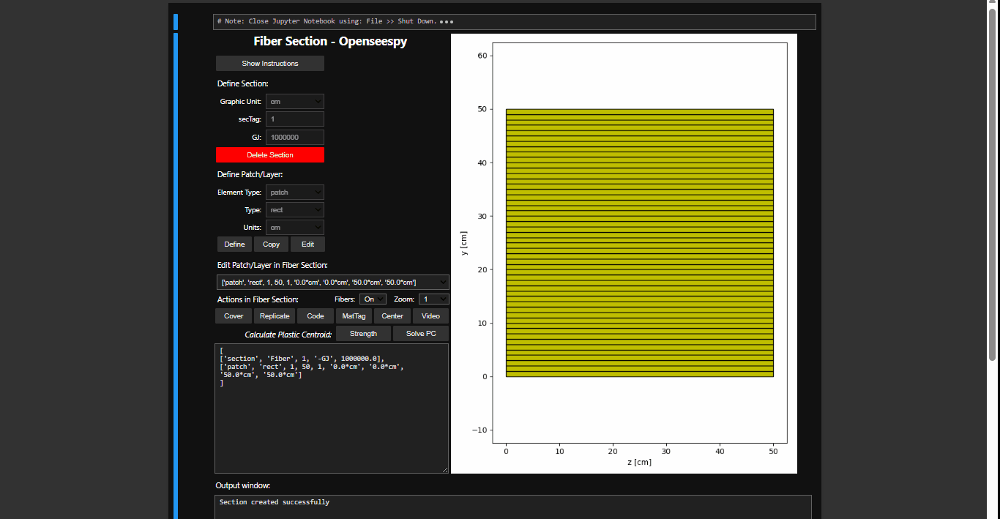
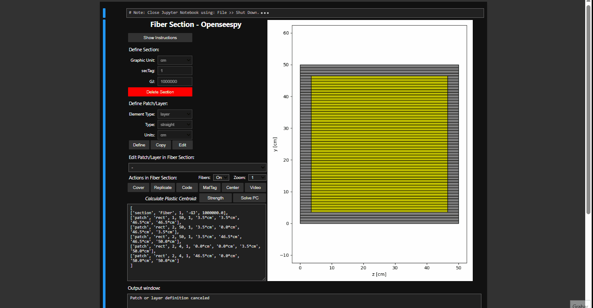
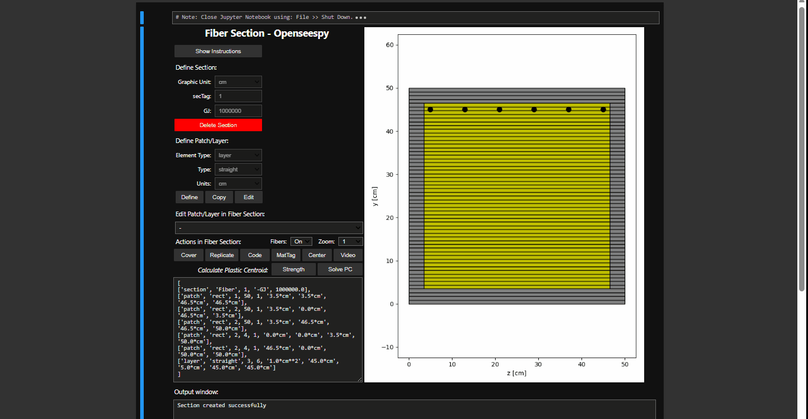
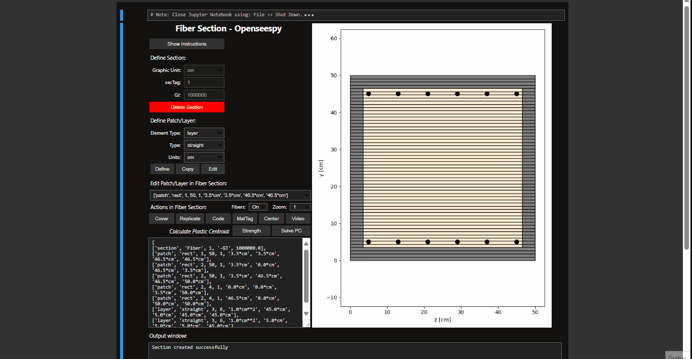
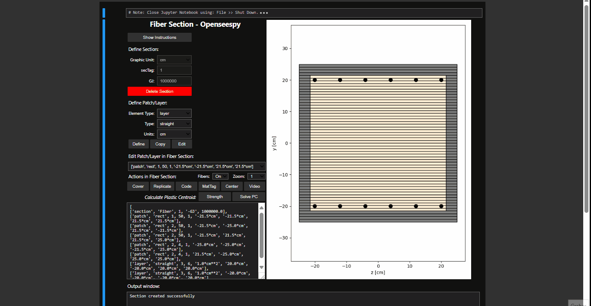
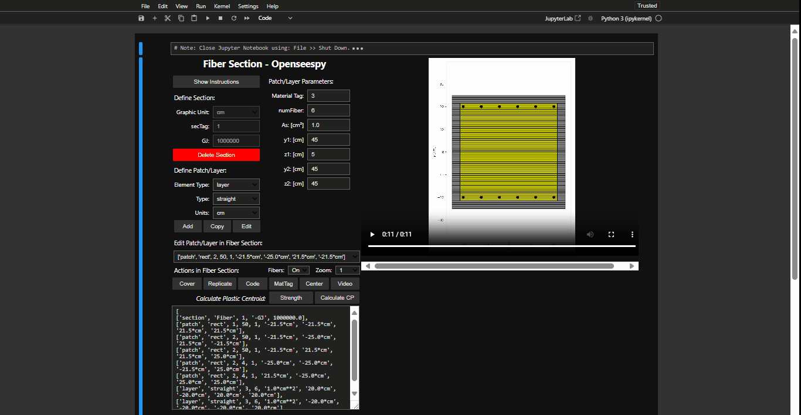

# FiberSection
Herramienta GUI que permite al usuario visualizar la definición de secciones en base a fibras en OpenSees python. El código está inspirado en los trabajos realizados por: 
- Código Matlab `plotSection.zip` escrito por D. Vamvatsikos disponible en  [http://users.ntua.gr/divamva/software.html](http://users.ntua.gr/divamva/software.html)
- Función `plot_fiber_section` de librería Opsvis escrito por Seweryn Kokot disponible en [https://opsvis.readthedocs.io/en/latest/](https://opsvis.readthedocs.io/en/latest/)

## Patch

## Cover

## Layer

## Replicate

## Centroide Plástico

## Center - Video

## Código


# INSTALACIÓN

## PARTE 1: Obtener los archivos del repositorio

### OPCIÓN A (Para principiantes): Descarga directa 🖥️
1. Ve al repositorio en GitHub
2. Haz clic en botón verde "Code"
3. Selecciona "Download ZIP"
4. Descomprime el archivo en tu computadora

### OPCIÓN B (Para usuarios con conocimientos técnicos): Clonar repositorio 👨‍💻
```bash
git clone https://github.com/MarceloX3/FiberSection
```

## PARTE 2: Configuración del Entorno
5. Abrir Anaconda Prompt
6. Crear entorno virtual
```bash
conda create -n env_FiberSection python=3.11
```
7. Activar entorno
```bash
conda activate env_FiberSection
```
8. Navegar a carpeta del proyecto
```bash
cd ruta/a/tu/proyecto
```
9. Instalar dependencias
```bash
conda install --file requirements.txt
```

## PARTE 3: Ejecución

### OPCIÓN A (Para principiantes): Ejecución manual
1. Abre Anaconda Prompt
2. Activa el entorno: `conda activate env_FiberSection`
3. 3.Inicia Jupyter Lab: `jupyter lab`
4. Abre el archivo `.ipynb`
5. Ejecuta

### OPCIÓN B (Para usuarios con conocimientos técnicos): Ejecución desde un acceso directo

Un archivo `.bat` (batch) es un script ejecutable en sistemas Windows que permite automatizar tareas, como activar un entorno virtual y ejecutar un archivo `.ipynb`. Este método facilita iniciar el proyecto directamente desde un acceso directo.

#### Pasos para configurar y usar un archivo `.bat`:

1. **Identificar la ruta del entorno virtual:**
   - Abre la GUI FiberSection acorde a las instrucciones de la Opción A.
   - Crea una nueva celda y ejecuta el siguiente código:
     ```python
     import sys
     print(sys.executable)
     ```
   - Copia el resultado, que es la ruta del entorno donde se ejecuta Jupyter. (Ejemplo: _C:\Users\USUARIO\anaconda3\envs\env_ChartMander1988_)

2. **Crear el archivo `.bat`:**
   - Abre un editor de texto.
   - Copia y pega el siguiente código, reemplazando `RUTA_DEL_ENTORNO` con la ruta obtenida en el paso anterior:
     ```batch
     @echo off
     
     REM Configurar la ruta del entorno virtual
     set ANACONDAPATH=RUTA_DEL_ENTORNO
     
     REM Configurar variables del entorno
     start %ANACONDAPATH%\python.exe %ANACONDAPATH%\cwp.py %ANACONDAPATH% ^
     
     REM Abrir el archivo .ipynb especificado con Jupyter Lab
     start %ANACONDAPATH%\python.exe -m jupyter lab %1
     
     exit
     ```
   - Guarda el archivo con la extensión `.bat` (por ejemplo, `IniciarNotebook.bat`).

3. **Asociar el archivo `.bat` con archivos `.ipynb`:**
   - Haz clic derecho sobre el archivo `S01_GUI_Fiber_Section.ipynb` y selecciona "Propiedades".
   - En "Abrir con", selecciona el archivo `.bat` creado.
   - Esto permitirá abrir el entorno y ejecutar el archivo automáticamente al hacer doble clic.

4. **Crear un acceso directo y personalizarlo (opcional):**
   - Crea un acceso directo al archivo `S01_GUI_Fiber_Section.ipynb`.
   - Mueve el acceso directo a un lugar conveniente.
   - Personaliza el icono haciendo clic derecho en el acceso directo, seleccionando "Propiedades" > "Cambiar icono" y eligiendo un archivo `.ico` característico.

Este método proporciona una forma práctica y rápida de iniciar el proyecto sin necesidad de abrir manualmente el entorno o Jupyter Lab.
